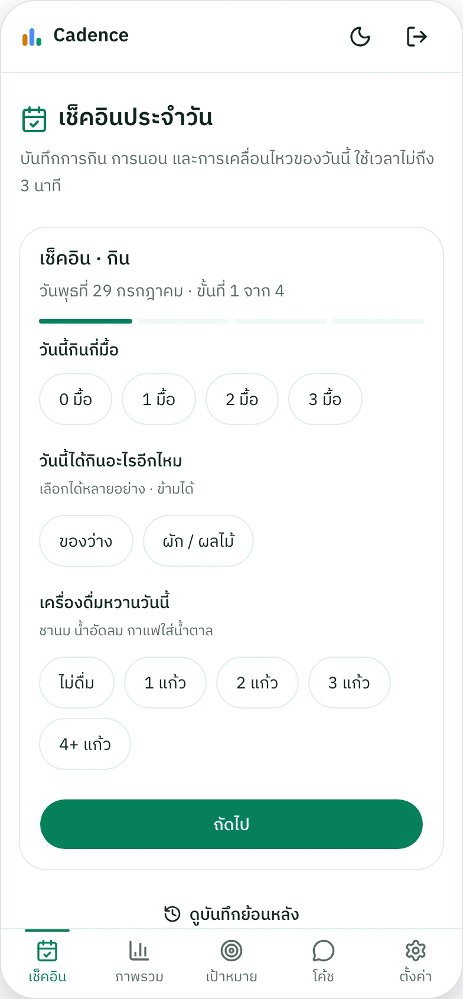
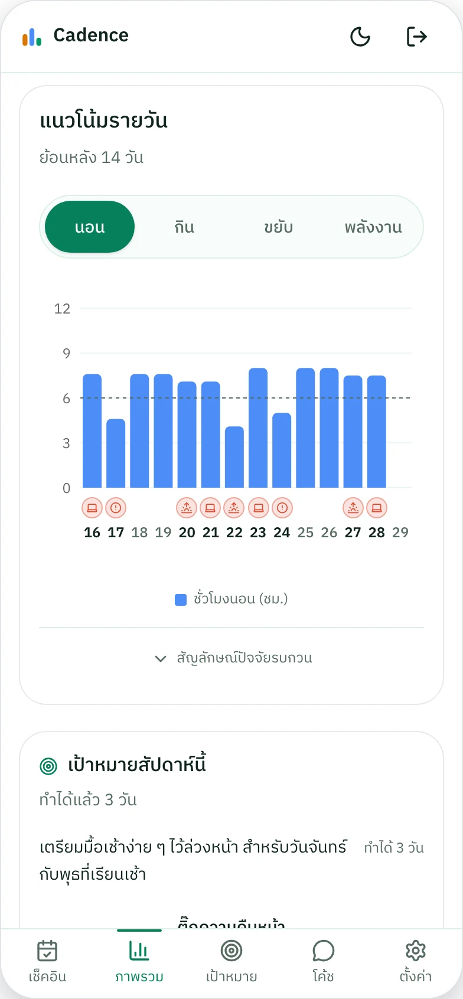
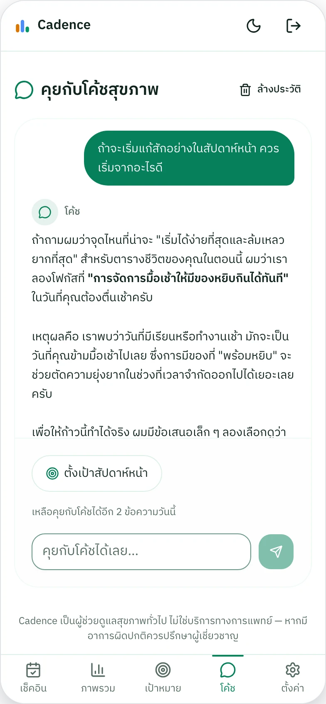
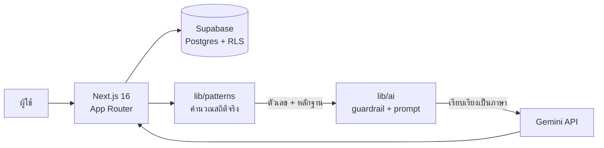

# Cadence

**เห็นจังหวะของตัวเอง แล้วเริ่มจากก้าวเล็ก ๆ ที่ทำได้จริง**

AI health coach สำหรับนักศึกษาและ first jobber — บันทึกวันละครั้งในเวลาไม่ถึงนาทีครึ่ง
แล้วระบบหาความสัมพันธ์ระหว่างการกิน–นอน–เคลื่อนไหวกับตารางชีวิตจริง

<i>An AI wellness coach for students and first jobbers. A 90-second daily check-in; statistics
computed in code, an LLM only puts them into words. Thai UI · live demo below.</i>

[**เปิดแอปจริง**](https://personal-healthcoach.vercel.app/) •
[ภาพรวม](#ภาพรวม) •
[สิ่งที่น่าดูในเชิงวิศวกรรม](#สิ่งที่น่าดูในเชิงวิศวกรรม) •
[ข้อจำกัด](#ข้อจำกัดที่เรารู้ตัว) •
[เอกสาร](#เอกสาร) •
[รันเอง](CONTRIBUTING.md)

<picture>
  <source media="(prefers-color-scheme: dark)" srcset="docs/assets/readme/dark-phone-checkin.webp">
  
</picture>
<picture>
  <source media="(prefers-color-scheme: dark)" srcset="docs/assets/readme/dark-phone-dashboard.webp">
  
</picture>
<picture>
  <source media="(prefers-color-scheme: dark)" srcset="docs/assets/readme/dark-phone-coach.webp">
  
</picture>

เช็คอิน 4 ขั้น ชิปกดล้วน · แนวโน้ม 4 แท็บ พร้อมวันที่มีปัจจัยรบกวน · โค้ชที่ตอบจากบันทึกจริง ไม่ใช่คำแนะนำสำเร็จรูป 
ภาพจริงจากแอป ไม่ใช่ mockup — ถ่ายที่ขนาดจอ iPhone 13 (390×844) · สลับ light/dark ตามธีมของคนอ่านเอง

## ลองเลย

| | |
| --- | --- |
| **แอปจริง** | [personal-healthcoach.vercel.app](https://personal-healthcoach.vercel.app/) |
| **บัญชี demo** | `palm@example.com` / `cadence-demo-2026` — มีข้อมูลจริง 4 สัปดาห์ ครบทั้ง dashboard · pattern · coach · goal · สรุปสัปดาห์ |
| **สรุปผลงาน 9 หน้า** | [showcase-en-light.pdf](docs/pitch/showcase-en-light.pdf) (ภาษาอังกฤษ) |

> [!NOTE]
> เป็นบัญชีสาธารณะ กรอก แก้ ลบได้ตามสบาย — [งาน scheduled](.github/workflows/refresh-demo.yml) สร้างข้อมูล 28 วันขึ้นใหม่ทุกตี 4
> ตั้งใจเว้นเช็คอิน**ของวันนี้**ไว้ว่าง เพื่อให้ลองกรอกเองได้ · แชทคุยกับโค้ชได้ 5 ข้อความต่อวัน (โควตา Gemini ฟรี)

## ภาพรวม

Cadence เป็น **wellness coach ไม่ใช่บริการทางการแพทย์** ผู้ใช้เช็คอินวันละครั้ง ใช้เวลา
**มัธยฐาน 1 นาที 26 วินาที** (จับเวลาจริง 24 ครั้ง) ระบบเชื่อมโยงการกิน–นอน–เคลื่อนไหวเข้ากับ
บริบทชีวิต (เดดไลน์ เรียนเช้า เดินทาง) แล้วเสนอก้าวเล็ก ๆ ที่ทำได้จริง โดยไม่ให้คะแนน
ไม่จัดเกรด และไม่กดดันเรื่องรูปร่าง

**ออกแบบเป็นแอปมือถือ ไม่ใช่เว็บไซต์** — ไม่มี landing page ไม่มี hero มีแค่ฟอร์ม dashboard และเมนูล่าง
ที่ ≥ 1024px เมนูล่างกลายเป็น sidebar ซ้าย ซึ่งเป็น breakpoint **เดียว** ที่แอปใช้จริง ([DESIGN.md](DESIGN.md))

```mermaid
flowchart LR
  U["ผู้ใช้"] --> APP["Next.js 16<br/>App Router"]
  APP --> DB[("Supabase<br/>Postgres + RLS")]
  APP --> P["lib/patterns<br/>คำนวณสถิติจริง"]
  P -- "ตัวเลข + หลักฐาน" --> AI["lib/ai<br/>guardrail + prompt"]
  AI -- "เรียบเรียงเป็นภาษา" --> G["Gemini API"]
  G --> APP
```

**สิ่งที่ระบบทำ**

- **เช็คอินรายวัน** 4 ขั้น เป็นชิปกดล้วน — คำถามเสริมโผล่เฉพาะเมื่อเกี่ยว (นอนดึก → ถามเหตุผล)
- **ภาพรวมสุขภาพ** กราฟแนวโน้ม 4 แท็บ + timeline "คืนสู่เช้า" + สัญลักษณ์วันที่มีปัจจัยรบกวน
- **วิเคราะห์รูปแบบ** เชื่อม 3 เสาเข้ากับตารางชีวิต (ต้องมีข้อมูล ≥ 7 วันถึงจะวิเคราะห์)
- **โค้ชสนทนา** ถามก่อนด้วยข้อมูลจริงของผู้ใช้ ไม่ใช่ช่องแชทเปล่า + guided flow ตั้งเป้า 4 ขั้น
- **Micro goal** สัปดาห์ละไม่เกิน 2 ข้อ ติ๊กความคืบหน้ารายวัน
- **สรุปสัปดาห์** พร้อมตัวเลขเทียบสัปดาห์ก่อนที่คำนวณสดในโค้ด (ไม่ใช้ AI ไม่กินโควตา)

**สิ่งที่ระบบไม่ทำ** — ไม่วินิจฉัยโรค ไม่แนะนำยา/อาหารเสริม ไม่ให้แผนลดน้ำหนัก ไม่เก็บน้ำหนัก/ส่วนสูง/BMI/แคลอรี/รูปถ่าย

## สิ่งที่น่าดูในเชิงวิศวกรรม

**1 · โค้ดคำนวณ LLM เล่าเรื่อง — แยกกันโดยโครงสร้าง ไม่ใช่โดยคำสั่งใน prompt**

`lib/patterns` นับความสัมพันธ์ 10 คู่จากข้อมูลจริง แล้วเก็บเฉพาะคู่ที่สองกลุ่มต่างกัน ≥ 20% และมีข้อมูล
≥ 3 วันต่อกลุ่ม · จากนั้นโค้ด**แนบตัวเลขหลักฐานกลับเข้าไปเองหลัง LLM ตอบ** ทำให้โมเดลไม่มีช่องแต่งตัวเลข
ตั้งแต่ต้น · ข้อมูลต่ำกว่า 7 วันไม่ถูกส่งให้ AI เลย ([07-ai-design.md](docs/07-ai-design.md))

**2 · ทดสอบ safety ด้วยผลรันดิบที่คอมมิตไม่ตัดต่อ**

10 เคส × 2 ประโยค บนโมเดล production · ปฏิเสธถูก 20/20 · เคสวิกฤตให้สายด่วน 9/9 · **คนตรวจไม่ใช่คนเขียน
prompt** · ที่สำคัญกว่าคือรอบแรก**ไม่ผ่าน** — โมเดลเขียนเชิงเหตุ-ผลจากข้อมูล 3 วัน เราแก้ prompt แล้วรันซ้ำ
ผลทั้งสองรอบอยู่ในเรโป ([ai-safety-test/](docs/issues/ai-safety-test/))

**3 · เลือกโมเดลจากผลวัด ไม่ใช่จากเวอร์ชัน**

ตอนมีรุ่นใหม่ออก วัดใหม่ทั้งชุดด้วยข้อมูลจริงและ pipeline จริง — รุ่นใหม่กว่าช้ากว่า 4 เท่าและโควตาเหลือ
20 ครั้ง/วัน จึง**ไม่เปลี่ยน** · โควตาทุกตัวมาจากการยิงชนเพดานเอง ไม่ใช่จากเอกสาร ([ADR-0003](docs/adr/0003-gemini-free-tier-ai.md))

**4 · ด่านที่รู้ว่าตัวเองจับอะไรไม่ได้**

unit test ครอบแค่ตรรกะใน `lib/` — PR ที่ทำ layout พังจะผ่าน `verify` เขียวหมด จึงมีด่าน e2e ที่เปิดหน้าจริง
ทุกหน้า × มือถือ/เดสก์ท็อป × light/dark แล้วเช็ค contrast ≥ 4.5:1 · ปุ่ม ≥ 44px · ไม่มี horizontal scroll ·
ไม่มี console error

**5 · เอกสารที่บันทึกความผิดพลาดของตัวเอง**

[11-limitations-future.md](docs/11-limitations-future.md) ไม่ใช่รายการข้อแก้ตัว — ทุกข้อจำกัดมาคู่กับสิ่งที่ทำไปแล้ว
เพื่อไม่ให้มันหลอกผู้ใช้ และหลายข้อมีเลข error หรือผลทดสอบกำกับ เพราะเจอจริงระหว่างสร้าง

## ข้อจำกัดที่เรารู้ตัว

- **ข้อมูลมาจากผู้ใช้กรอกเองทั้งหมด** ไม่มีเซนเซอร์ยืนยัน — เราจึงออกแบบให้การกรอกตามจริงไม่มีต้นทุนทางใจ (ไม่มีคะแนน ไม่มีสตรีค ภาษาไม่ตัดสิน)
- **ยังไม่ได้ประเมินกับผู้ใช้จริงนอกทีม** — ผู้ทดสอบ 4 คนคือคนสร้างเอง ตัวเลขที่วัดได้จึงเป็นเพดานของดีไซน์ ไม่ใช่พื้นของคนใช้ครั้งแรก
- **pattern ที่เจอคือความสัมพันธ์ ไม่ใช่เหตุและผล** — โค้ดไม่ส่งข้อมูล < 7 วันให้ LLM · prompt ห้ามสรุปเหตุ-ผล · มีรายการคำเชิงสาเหตุที่ตรวจจับได้
- **LLM ควบคุมได้ไม่ 100%** — ทุกเป้าหมายต้องผ่าน `validateGoalTitle()` ก่อนถูกใช้ ไม่ผ่านคือทิ้งแล้วตกไปใช้เป้ามาตรฐาน

อ่านเต็มพร้อมแผนถ้าไปต่อที่ [docs/11-limitations-future.md](docs/11-limitations-future.md)

## ความเป็นส่วนตัว

ข้อมูลสุขภาพเห็นได้เฉพาะเจ้าของบัญชี (บังคับด้วย RLS ระดับฐานข้อมูล ตรวจซ้ำด้วย `npm run verify:rls`) ·
ผู้ใช้ลบข้อมูลหรือลบบัญชีเองได้ทุกเมื่อ · **ไม่ส่งชื่อหรืออีเมลให้โมเดล** ส่งเฉพาะข้อมูลพฤติกรรม
([08-safety-privacy.md](docs/08-safety-privacy.md))

## เอกสาร

| ไฟล์ | เนื้อหา |
| --- | --- |
| [docs/](docs/README.md) | สารบัญเอกสารออกแบบ 11 ฉบับ — ปัญหา → persona → data → architecture → AI → safety → limitations |
| [docs/adr/](docs/adr/) | เหตุผลเบื้องหลังการตัดสินใจทางเทคนิค 5 ฉบับ |
| [docs/issues/](docs/issues/) | issue tracker ที่โปรเจกต์นี้เดินด้วยจริง 69 ใบ ปิดพร้อมหลักฐานและผูกกับ PR |
| [docs/12-ui-inventory.md](docs/12-ui-inventory.md) | ทุก route ทุก state ตามที่แอปทำงานจริง พร้อมลิงก์เข้าโค้ด |
| [CONTEXT.md](CONTEXT.md) | glossary ภาษากลาง ใช้คำตามนิยามนี้ทั้งในโค้ด issue และ UI copy |
| [DESIGN.md](DESIGN.md) | กฎ UI ที่บังคับใช้จริง พร้อมเหตุการณ์ที่ทำให้เกิดกฎแต่ละข้อ |
| [CONTRIBUTING.md](CONTRIBUTING.md) | วิธีรันเอง · ตัวแปรสภาพแวดล้อม · คำสั่งทั้งหมด · กติกาก่อนเปิด PR |

---

สร้างโดยทีม 4 คนใน 4 สัปดาห์ ด้วยงบ 0 บาท สำหรับ CSTU Spark Camp in AI 2569 (Mission #5) ·
Deploy อัตโนมัติจาก `main` ไป [personal-healthcoach.vercel.app](https://personal-healthcoach.vercel.app/) ·
สัญญาอนุญาต [MIT](LICENSE)
