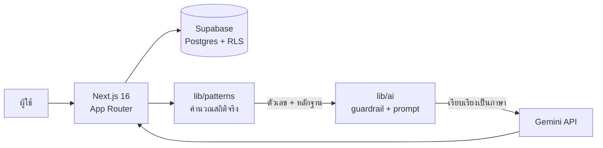

<div align="center">


# Cadence

**เห็นจังหวะของตัวเอง แล้วเริ่มจากก้าวเล็ก ๆ ที่ทำได้จริง**

AI Personal Health Coach สำหรับนักศึกษาและ first jobber — ช่วยให้เห็น pattern การกิน–นอน–เคลื่อนไหว
ของตัวเอง แล้วตั้ง micro goal ที่ทำได้จริงในชีวิตที่ตารางไม่แน่นอน

[](https://github.com/nkieu-config/cadence-ai-health-coach/actions/workflows/ci.yml)


[**เปิดแอปจริง**](https://personal-healthcoach.vercel.app/) •
[ภาพรวม](#ภาพรวม) •
[สำหรับกรรมการ](#สำหรับกรรมการ--ผู้รีวิว) •
[ข้อจำกัด](#ข้อจำกัดที่เรารู้ตัว) •
[เริ่มใช้งาน](#เริ่มใช้งาน) •
[คำสั่ง](#คำสั่งที่มี) •
[เอกสาร](#เอกสาร)

<picture>
  <source media="(prefers-color-scheme: dark)" srcset="docs/assets/readme/dark-phone-checkin.webp">
  
</picture>
<picture>
  <source media="(prefers-color-scheme: dark)" srcset="docs/assets/readme/dark-phone-dashboard.webp">
  
</picture>
<picture>
  <source media="(prefers-color-scheme: dark)" srcset="docs/assets/readme/dark-phone-coach.webp">
  
</picture>

<sub>เช็คอิน 4 ขั้น ชิปกดล้วน · แนวโน้ม 4 แท็บ พร้อมวันที่มีปัจจัยรบกวน · โค้ชที่ตอบจากบันทึกจริง ไม่ใช่คำแนะนำสำเร็จรูป<br>
ภาพจริงจากแอป ไม่ใช่ mockup — ถ่ายที่ขนาดจอ iPhone 13 (390×844) เมื่อ 29 ก.ค. 2569 · สลับ light/dark ตามธีมของคนอ่านเอง</sub>

</div>

## ภาพรวม

Cadence เป็น **wellness coach ไม่ใช่บริการทางการแพทย์** ผู้ใช้เช็คอินวันละครั้ง ใช้เวลา**มัธยฐาน 1 นาที 26 วินาที** (จับเวลาจริง 24 ครั้ง)
ระบบเชื่อมโยงการกิน–นอน–เคลื่อนไหวเข้ากับบริบทชีวิต (เดดไลน์ เรียนเช้า เดินทาง) แล้วเสนอก้าวเล็ก ๆ
ที่ทำได้จริง โดยไม่ให้คะแนน ไม่จัดเกรด และไม่กดดันเรื่องรูปร่าง

**ออกแบบเป็นแอปมือถือ ไม่ใช่เว็บไซต์** — ไม่มี landing page ไม่มี hero มีแค่ฟอร์ม dashboard และเมนูล่าง
ที่ ≥ 1024px เมนูล่างกลายเป็น sidebar ซ้าย ซึ่งเป็น breakpoint **เดียว** ที่แอปใช้จริง ([DESIGN.md](DESIGN.md))


```mermaid
flowchart LR
  U["ผู้ใช้"] --> APP["Next.js 16<br/>App Router"]
  APP --> DB[("Supabase<br/>Postgres + RLS")]
  APP --> P["lib/patterns<br/>คำนวณสถิติจริง"]
  P -- "ตัวเลข + หลักฐาน" --> AI["lib/ai<br/>guardrail + prompt"]
  AI -- "เรียบเรียงเป็นภาษา" --> G["Gemini API"]
  G --> APP
```

> [!IMPORTANT]
> **ตัวเลขทุกตัวที่ AI พูดถึงมาจาก `lib/patterns` ไม่ใช่จาก LLM** — Gemini ทำหน้าที่เรียบเรียงเป็นภาษาเท่านั้น
> ถ้า Gemini ล่มหรือโควตาหมด ระบบ fallback เป็น template ที่ยังใช้ตัวเลขจริง หน้าไม่พัง

**สิ่งที่ระบบทำ**

- **เช็คอินรายวัน** 4 ขั้น เป็นชิปกดล้วน — คำถามเสริมโผล่เฉพาะเมื่อเกี่ยว (นอนดึก → ถามเหตุผล)
- **ภาพรวมสุขภาพ** กราฟแนวโน้ม 4 แท็บ + timeline "คืนสู่เช้า" + สัญลักษณ์วันที่มีปัจจัยรบกวน
- **วิเคราะห์รูปแบบ** เชื่อม 3 เสาเข้ากับตารางชีวิต (ต้องมีข้อมูล ≥ 7 วันถึงจะวิเคราะห์)
- **โค้ชสนทนา** ถามก่อนด้วยข้อมูลจริงของผู้ใช้ ไม่ใช่ช่องแชทเปล่า + guided flow ตั้งเป้า 4 ขั้น
- **Micro goal** สัปดาห์ละไม่เกิน 2 ข้อ ติ๊กความคืบหน้ารายวัน
- **สรุปสัปดาห์** พร้อมตัวเลขเทียบสัปดาห์ก่อนที่คำนวณสดในโค้ด (ไม่ใช้ AI ไม่กินโควตา)

**สิ่งที่ระบบไม่ทำ** — ไม่วินิจฉัยโรค ไม่แนะนำยา/อาหารเสริม ไม่ให้แผนลดน้ำหนัก ไม่เก็บน้ำหนัก/ส่วนสูง/BMI/แคลอรี/รูปถ่าย

## สำหรับกรรมการ / ผู้รีวิว

เริ่มตรงนี้ ใช้เวลาราว 15 นาที

| ลำดับ | อยากเห็นอะไร | เปิดที่ |
| --- | --- | --- |
| 1 | **ระบบจริง** — บัญชีทดลองมีข้อมูลจริง 4 สัปดาห์ ครบทั้ง dashboard, pattern, coach, goal, reflection | [แอปบน production](https://personal-healthcoach.vercel.app/)<br/>`judge@example.com` / `judgecadence123` |
| 2 | **Deliverables ครบ 14 ข้อ อยู่ไหนบ้าง** — สารบัญ map ข้อต่อข้อ + เกณฑ์ให้คะแนน 9 ข้อ | [docs/10-deliverables-checklist.md](docs/10-deliverables-checklist.md) |
| 3 | **หลักฐาน Safety** — 10 เคส × 2 ประโยค = 20/20 บนโมเดล production ผลดิบไม่ตัดต่อ + ลายเซ็นผู้ตรวจอิสระ | [.scratch/ai-safety-test/](.scratch/ai-safety-test/) |
| 4 | **เอกสารออกแบบ** — ปัญหา → persona → data → architecture → AI → safety/privacy → limitations | [docs/](docs/README.md) อ่านเรียงเลข 01→12 |
| 5 | **UI ทุกหน้า ทุกสถานะ** — บันทึกว่าแอปเป็นอย่างไรจริง พร้อมลิงก์โค้ดทุกจุด | [docs/12-ui-inventory.md](docs/12-ui-inventory.md) |
| 6 | **Process ของทีม** — issue tracker 69 งาน (ปิดแล้ว 65), PR history, CI 2 ด่านบังคับ | [.scratch/BOARD.md](.scratch/BOARD.md) + แท็บ Pull requests |

## ข้อจำกัดที่เรารู้ตัว

- **ข้อมูลมาจากผู้ใช้กรอกเองทั้งหมด** ไม่มีเซนเซอร์ยืนยัน — เราจึงออกแบบให้การกรอกตามจริงไม่มีต้นทุนทางใจ (ไม่มีคะแนน ไม่มีสตรีค ภาษาไม่ตัดสิน)
- **ยังไม่ได้ประเมินกับผู้ใช้จริงนอกทีม** — ผู้ทดสอบ 4 คนคือคนสร้างเอง ตัวเลขที่วัดได้จึงเป็นเพดานของดีไซน์ ไม่ใช่พื้นของคนใช้ครั้งแรก
- **pattern ที่เจอคือความสัมพันธ์ ไม่ใช่เหตุและผล** — โค้ดไม่ส่งข้อมูล < 7 วันให้ LLM · prompt ห้ามสรุปเหตุ-ผล · มีรายการคำเชิงสาเหตุที่ตรวจจับได้
- **LLM ควบคุมได้ไม่ 100%** — ทุกเป้าหมายต้องผ่าน `validateGoalTitle()` ก่อนถูกใช้ ไม่ผ่านคือทิ้งแล้วตกไปใช้เป้ามาตรฐาน

ทุกข้อมาคู่กับสิ่งที่ทำไปแล้วเพื่อไม่ให้มันหลอกผู้ใช้ และแผนถ้าไปต่อ — อ่านเต็มที่ [docs/11-limitations-future.md](docs/11-limitations-future.md)

## เริ่มใช้งาน

**ต้องมีก่อน:** Node.js 22 ขึ้นไป (ตาม [`.nvmrc`](.nvmrc)) · บัญชี Supabase และ Gemini API key

```bash
git clone https://github.com/nkieu-config/cadence-ai-health-coach.git
cd cadence-ai-health-coach
cp .env.example .env.local    # เติมค่าตามตารางด้านล่าง
npm ci
npm run dev                   # http://localhost:3000
```

### ตัวแปรสภาพแวดล้อม

| ตัวแปร | ต้องมีไหม | หมายเหตุ |
| --- | --- | --- |
| `NEXT_PUBLIC_SUPABASE_URL` | ✅ | ขอจาก A (ค่าเดียวกันทั้งทีม) |
| `NEXT_PUBLIC_SUPABASE_ANON_KEY` | ✅ | ค่าเดียวกันทั้งทีม |
| `GEMINI_API_KEY` | ✅ | **ของแต่ละคนเอง** ขอฟรีที่ [aistudio.google.com](https://aistudio.google.com/apikey) — โควตานับต่อโปรเจกต์ × โมเดล การใช้ key ร่วมกันจะแย่ง rate limit กันตอน dev |
| `SUPABASE_SERVICE_ROLE_KEY` | — | bypass RLS ได้ทั้งฐาน A ถือคนเดียว · ไม่มีก็รันแอปได้ปกติ แต่สคริปต์เตรียม/ตรวจข้อมูลรันไม่ได้ (ดูใต้ตาราง) |
| `AI_MODEL` | ❌ | **ห้ามตั้งค้างไว้** — โมเดล production ล็อกที่ `src/lib/ai/model.ts` แล้ว มีไว้ override ชั่วคราวเท่านั้น |

> [!WARNING]
> ตั้ง `AI_MODEL` ค้างไว้ = รันคนละโมเดลกับ production เงียบ ๆ **เคยทำหลักฐาน safety เสียมาแล้ว 2 รอบ** (ดู INFRA-23)

**14 สคริปต์ที่ต้องมี `SUPABASE_SERVICE_ROLE_KEY`** — `seed` · `refresh:demo-week` · `backfill:demo-ai` · `seed:coach-chat` ·
`verify:db` · `verify:rls` · `verify:seed` · `verify:user` · `test:insight` · `test:goal` · `test:reflection` · `test:coach` ·
`test:coach-safety` · `compare:models` · **`test:ai` ไม่ต้องมี** (ใช้ Gemini key อย่างเดียว) · `shots` กับ `shots:readme` ล็อกอินเป็นผู้ใช้ปกติ

Schema และ RLS อยู่ที่ [`supabase/migrations/`](supabase/migrations/) (`0001`→`0005`) — A รันบน project กลางให้แล้ว
เพื่อนร่วมทีมแค่ `git pull` ก็ใช้ได้ · ตรวจว่า schema ตรงจริงด้วย `npm run verify:db` (ต้องมี service-role key)

## ก่อนเปิด PR

คำสั่ง 5 ด่านที่ต้องรันและกติกาการทำงานทั้งหมดอยู่ใน **[AGENTS.md](AGENTS.md) ที่เดียว** —
README ไม่เก็บสำเนาไว้ เพราะกฎที่มีสองสำเนาคือกฎที่จะเพี้ยนกันเอง · ด้านล่างคือสิ่งที่ AGENTS.md ไม่ได้บอก

CI บังคับ **2 ด่านทุก PR**: `verify` (format · lint · tsc · test · build) และ `e2e (เปิดแอปจริง)` ซึ่งเปิดทุกหน้าจริงบน
มือถือ+เดสก์ท็อป × light+dark แล้วเช็ค h1 อันเดียว · ไม่มี horizontal scroll · ปุ่ม ≥ 44px ·
contrast ≥ 4.5:1 · ไม่มี console error

> [!CAUTION]
> unit test ครอบแค่ตรรกะใน `lib/` — **PR ที่ทำ layout พังหรือ dashboard ขาว จะผ่าน `verify` เขียวหมด**
> `e2e` คือด่านเดียวที่จับได้

> [!NOTE]
> CI รันเฉพาะ [`e2e/routes.spec.ts`](e2e/routes.spec.ts) กับ [`e2e/theme.spec.ts`](e2e/theme.spec.ts) ซึ่งไม่แตะข้อมูลบัญชี demo ·
> เทสต์ที่เขียนข้อมูล ([`checkin.spec.ts`](e2e/checkin.spec.ts)) และเทสต์อื่นรันบนเครื่องตัวเองด้วย `npm run e2e`

**กฎ UI ทั้งหมด** อยู่ในส่วนแรกของ [DESIGN.md](DESIGN.md) — บังคับถ้าจะแตะหน้าจอ

## คำสั่งที่มี

| คำสั่ง | ทำอะไร |
| --- | --- |
| `npm run dev` | dev server |
| `npm run build` · `npm run lint` | build production · เช็ค lint |
| `npm test` | unit test (vitest) — ตรรกะใน `lib/` |
| `npm run e2e` | เปิดทุกหน้าจริง × มือถือ/เดสก์ท็อป × light/dark (~40 วิ) — **ต้องรันถ้าแตะ UI** |
| `npm run verify:db` | ยืนยัน schema + RLS (ตารางครบ · anon เข้าไม่ได้ · user เห็นข้ามกันไม่ได้) รันซ้ำได้หลังแก้ schema |
| `npm run test:ai` | ยิงเคสภาษาไทยผ่าน `lib/ai` เช็ค guardrail + latency · เจาะเคสเดียวด้วย `-- <id/category>` |
| `npm run shots` | ถ่าย screenshot ทุกหน้า × light/dark × มือถือ/เดสก์ท็อป ลง `docs/pitch/screenshots/` |
| `npm run shots:readme` | ถ่ายภาพชุดที่ใช้ใน README ลง `docs/assets/readme/` — เฉพาะส่วนที่เห็นบนจอ ใส่กรอบมือถือ แปลงเป็น WebP (ต้องมี `cwebp`) |
| `npm run refresh:demo-week` | **เตรียมบัญชี demo ก่อนนำเสนอ** — เติม goal สัปดาห์ปัจจุบัน + อุ่น insight/reflection ให้ตรงวัน · `-- --goal-only` = ไม่ยิง Gemini |

> [!TIP]
> ของในบัญชี demo ผูกกับวันที่ จึงเก่าเองทุกวัน — เช้าวันนำเสนอให้รัน `npm run refresh:demo-week` ก่อนเสมอ
> ขั้นตอนเต็มอยู่ใน [docs/pitch/demo-script.md](docs/pitch/demo-script.md)

คำสั่งที่ยิง Supabase หรือ Gemini ต้องมี `.env.local` ครบ · `test:ai` คือสคริปต์ที่ผลิต[หลักฐาน safety](.scratch/ai-safety-test/) ของ QA-01

## โครงสร้างโปรเจกต์

```
src/
├── app/                  หน้าและ route ทั้งหมด (App Router)
├── proxy.ts              auth guard — Next.js 16 ใช้ชื่อนี้แทน middleware.ts
├── lib/
│   ├── ai/               Gemini + system prompt guardrail — ทุก AI call ต้องผ่านที่นี่
│   ├── patterns/         คำนวณ pattern จากสถิติจริง (ไม่ใช่ AI)
│   ├── supabase/         client (browser) / server / admin
│   └── checkins/         วันที่ · label ภาษาไทย · validation
├── components/ui/        shadcn/ui
supabase/migrations/      SQL schema + RLS
docs/                     เอกสารทั้งหมด — เริ่มที่ docs/README.md
.scratch/                 issue tracker (ไม่มี tracker ภายนอก) — ภาพรวมที่ .scratch/BOARD.md
CONTEXT.md                glossary ภาษากลาง — อ่านก่อนตั้งชื่อตัวแปรหรือเขียน UI copy
DESIGN.md                 กฎ UI — บังคับถ้าจะแตะหน้าจอ
AGENTS.md · CLAUDE.md     กติกาสำหรับ AI coding agent
```

> [!NOTE]
> **Next.js 16 ต่างจากที่คุ้นเคย** — auth guard คือ `src/proxy.ts` (ไม่ใช่ `middleware.ts`) และ API หลายตัวเปลี่ยนไป
> ก่อนเขียนโค้ดให้อ่าน docs ที่มากับแพ็กเกจใน `node_modules/next/dist/docs/`

## บัญชีที่ใช้ทดสอบ

> [!CAUTION]
> **ห้ามเทสด้วยบัญชีปาล์ม** — ใช้ `qa-bot@example.com` ที่เตรียมไว้แล้ว (ข้อมูลชุดเดียวกัน · เละแล้ว `seed` คืนสภาพได้ ·
> รหัสอยู่ใน [.scratch/BOARD.md](.scratch/BOARD.md)) · ปาล์มคือบัญชีที่ใช้ demo วันนำเสนอ และ**ฐานข้อมูลมีชุดเดียว**
> ไม่ว่าจะรันจาก localhost หรือ production ก็แตะแถวเดียวกัน

## เอกสาร

| ไฟล์ | เนื้อหา |
| --- | --- |
| [docs/README.md](docs/README.md) | สารบัญเอกสารทั้งหมด อ่านเรียงเลข 01→12 |
| [docs/00-mission-brief.md](docs/00-mission-brief.md) | โจทย์ต้นทาง (Mission #5) — อ้างอิงเสมอเวลาตัดสิน scope |
| [docs/12-ui-inventory.md](docs/12-ui-inventory.md) | แอปมีหน้าตาและพฤติกรรมอย่างไรจริง ทุก route ทุก state |
| [docs/adr/](docs/adr/) | เหตุผลเบื้องหลังการตัดสินใจทางเทคนิค (ADR-0001→0005) |
| [CONTEXT.md](CONTEXT.md) | glossary ภาษากลาง ใช้คำตามนิยามนี้ทั้งในโค้ด issue และ UI copy |
| [DESIGN.md](DESIGN.md) | กฎ UI ที่บังคับใช้จริง + ที่มาของ theme |

Deploy อัตโนมัติจาก branch `main` ไป [personal-healthcoach.vercel.app](https://personal-healthcoach.vercel.app/)

สัญญาอนุญาต [MIT](LICENSE) — งานส่ง Mission #5 · CSTU Spark Camp in AI 2569
