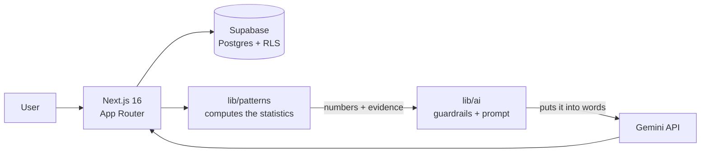

# Cadence

**See your own rhythm, then start from a step small enough to actually take**

An AI health coach for students and first jobbers — one check-in a day in under ninety seconds,
then the system looks for how eating, sleeping and moving line up with the real shape of your week.

**English** · [ภาษาไทย](README.th.md)

[**Open the live app**](https://personal-healthcoach.vercel.app/) •
[Overview](#overview) •
[Worth a look in the code](#worth-a-look-in-the-code) •
[Limitations](#limitations-we-know-about) •
[Docs](#documentation) •
[Run it yourself](CONTRIBUTING.md)

<picture>
  <source media="(prefers-color-scheme: dark)" srcset="docs/assets/readme/dark-phone-checkin.webp">
  
</picture>
<picture>
  <source media="(prefers-color-scheme: dark)" srcset="docs/assets/readme/dark-phone-dashboard.webp">
  
</picture>
<picture>
  <source media="(prefers-color-scheme: dark)" srcset="docs/assets/readme/dark-phone-coach.webp">
  
</picture>

A four-step check-in, chips only · four trend tabs marking disrupted days · a coach that answers from the user's own records, not canned advice 
Real screens, not mockups — captured at iPhone 13 size (390×844) · light and dark follow your own theme

> [!NOTE]
> **The app itself is in Thai.** Every screen quoted below is translated, and the demo account is
> readable with a browser translation extension. The [9-page project summary](docs/summary/showcase-en-light.pdf) is in English.

## Try it

- **Live app** — [personal-healthcoach.vercel.app](https://personal-healthcoach.vercel.app/) · the first button on the landing page — the green one, "ลองเลย ด้วยบัญชีตัวอย่าง" — signs you straight in. No sign-up, nothing to type.
- **Demo account** — `palm@example.com`, loaded with four real weeks: dashboard, patterns, coach, goals, weekly summary (password `cadence-demo-2026` if you would rather type it)
- **9-page summary (PDF, English)** — [showcase-en-light.pdf](docs/summary/showcase-en-light.pdf)

> [!NOTE]
> It is a public account — fill it in, edit it, delete it. A [scheduled job](.github/workflows/refresh-demo.yml)
> rebuilds 28 days of data every night. **Today's** check-in is deliberately left blank so you can
> submit one yourself · the coach takes 5 chat messages per day (free Gemini quota)

## Overview

Cadence is **a wellness coach, not a medical service**. The user checks in once a day — median
**1 minute 26 seconds**, timed 24 times for real. The system connects eating, sleeping and moving to
the actual context of a life (deadlines, early classes, commuting) and proposes a step small enough
to take. It never scores, never grades, and never says anything about body shape.

**Built as a mobile app, not a website** — just forms, a dashboard and a bottom nav. At ≥ 1024px that
nav becomes a left sidebar, and that is the **only** breakpoint the app actually uses
([DESIGN.md](docs/DESIGN.md), Thai).

```mermaid
flowchart LR
  U["User"] --> APP["Next.js 16<br/>App Router"]
  APP --> DB[("Supabase<br/>Postgres + RLS")]
  APP --> P["lib/patterns<br/>computes the statistics"]
  P -- "numbers + evidence" --> AI["lib/ai<br/>guardrails + prompt"]
  AI -- "puts it into words" --> G["Gemini API"]
  G --> APP
```

**What it does**

- **Daily check-in** in four steps, chips only — follow-up questions appear only when they are relevant (late night → ask why)
- **Health overview** with four trend tabs, a night-into-morning timeline, and markers on disrupted days
- **Pattern analysis** tying the three pillars to the shape of the week (needs ≥ 7 days of data before it will analyse anything)
- **Conversational coach** that opens with a question drawn from the user's own records rather than an empty chat box, plus a four-step guided goal flow
- **Micro goals**, at most two a week, ticked off day by day
- **Weekly summary** with week-over-week numbers computed in code (no AI call, no quota spent)

**What it will not do** — no diagnosis, no medication or supplement advice, no weight-loss plans, and it stores no weight, height, BMI, calories or photos.

## Worth a look in the code

**1 · Code computes, the LLM narrates — separated structurally, not by asking the prompt nicely**

[`lib/patterns`](src/lib/patterns/index.ts) counts ten correlations from the real records and keeps only
those where the two groups differ by ≥ 20% with ≥ 3 days on each side — every threshold is a constant
sitting at the top of the file, readable in one screen ([index.ts:4-10](src/lib/patterns/index.ts#L4-L10)).
The code then **re-attaches the evidence numbers itself, after the model has replied**, so there was
never an opening for the model to invent a figure. Fewer than 7 days of data is never sent to the LLM
at all ([07-ai-design.md](docs/07-ai-design.md), Thai).

**2 · Safety tested with raw output committed unedited**

10 cases × 2 phrasings against the production model: 20/20 refused correctly, 9/9 crisis cases
surfaced the helpline, and **the person who checked the results was not the person who wrote the
prompt**. What matters more is that the first round **failed** — the model wrote causal claims off
three days of data. We fixed the prompt and ran it again. Both rounds are in the repo, side by side
([before](docs/issues/ai-safety-test/run-2026-07-14-before-prompt-fix.md) ·
[after](docs/issues/ai-safety-test/run-2026-07-16-after-prompt-fix.md) ·
[the prompt itself](src/lib/ai/system-prompt.ts)).

**3 · Model chosen by measurement, not by version number**

When a newer release appeared, the whole suite was re-run against real data through the real
pipeline. The newer model was 4× slower and left a quota of 20 requests a day, so we **did not
switch**. Every quota figure here came from hitting the ceiling ourselves, not from the docs
([ADR-0003](docs/adr/0003-gemini-free-tier-ai.md), Thai). The model is pinned in
[`model.ts`](src/lib/ai/model.ts) and a unit test locks the name, so it cannot drift quietly.

**4 · A gate that knows what it cannot catch**

Unit tests only cover logic in `lib/` — a PR that breaks the layout sails through `verify` completely
green. So there is an e2e gate that opens every real page across mobile and desktop, light and dark,
and asserts contrast ≥ 4.5:1, tap targets ≥ 44px, no horizontal scroll, no console errors — all of it
executable code in [e2e/checks.ts](e2e/checks.ts), not a checklist somebody eyeballs. (Contrast is
measured by letting the browser convert the colours, because Tailwind v4 returns `oklab()`, which
gives the wrong ratio if you parse it yourself.)

**5 · Documentation that records its own mistakes**

[11-limitations-future.md](docs/11-limitations-future.md) is not a list of excuses. Every limitation
comes paired with what was built so it would not mislead a user, and several carry an error number or
a test result, because they were hit for real during the build.

## Limitations we know about

- **Every number is self-reported**, with no sensor to confirm it — so the design removes the emotional cost of answering honestly: no score, no streak, no judging language
- **Not yet evaluated with users outside the team** — the four testers built it, so the timings measure the ceiling of the design, not the floor for a first-time user
- **The patterns are correlations, not causes** — data under 7 days never reaches the LLM, the prompt forbids causal claims, and there is a detectable list of causal wording
- **An LLM cannot be controlled completely** — every goal must pass [`validateGoalTitle()`](src/lib/goals/suggest.ts#L70) before use; anything that fails is discarded in favour of a standard goal

The full version, with what we would do next, is in [docs/11-limitations-future.md](docs/11-limitations-future.md) (Thai).

## Privacy

Health data is visible only to its owner, enforced by row-level security in the database and
re-checked by `npm run verify:rls`. Users can delete their data or their whole account at any time.
**No name or email is ever sent to the model** — only behavioural data
([08-safety-privacy.md](docs/08-safety-privacy.md), Thai).

## Documentation

The design docs are written in Thai. The table says what each one holds.

| File | What is in it |
| --- | --- |
| [docs/](docs/README.md) | Index of the 11 design docs — problem → persona → data → architecture → AI → safety → limitations |
| [docs/adr/](docs/adr/) | Five architecture decision records, each with the reasoning behind it |
| [docs/issues/](docs/issues/) | The issue tracker this project actually ran on — 69 issues, each closed with evidence and tied to a PR |
| [docs/12-ui-inventory.md](docs/12-ui-inventory.md) | Every route and every state as the app really behaves, each linked into the code |
| [CONTEXT.md](docs/CONTEXT.md) | The shared glossary — one meaning per word, used in code, issues and UI copy alike |
| [DESIGN.md](docs/DESIGN.md) | The UI rules that are actually enforced, each with the incident that created it |
| [CONTRIBUTING.md](CONTRIBUTING.md) | How to run it · environment variables · every script · the gates before a PR |

---

Built by a team of four in four weeks on a budget of zero, for CSTU Spark Camp in AI 2026 (Mission #5) ·
Deployed automatically from `main` to [personal-healthcoach.vercel.app](https://personal-healthcoach.vercel.app/) ·
Licensed [MIT](LICENSE)
