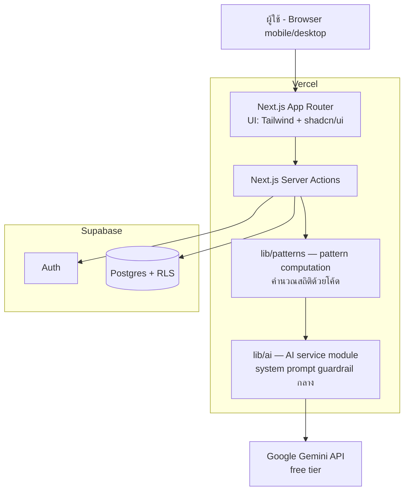
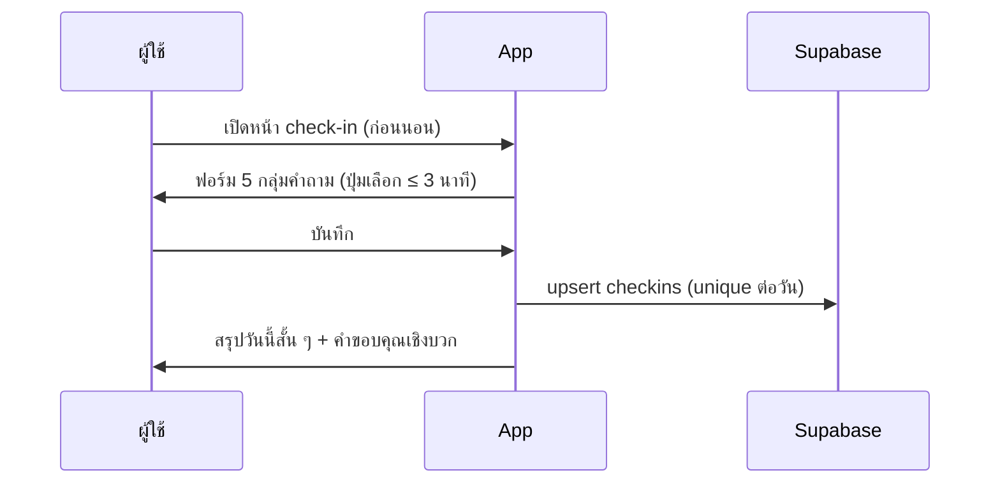
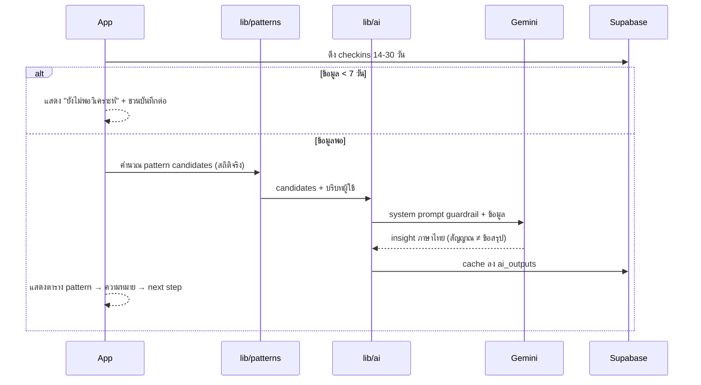
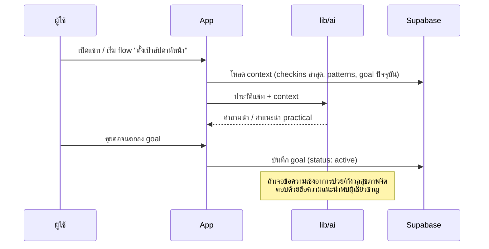

# 06 — System Architecture & Workflow

## ภาพรวมสถาปัตยกรรม



หลักการสำคัญ:

- **ตัวเลขมาจากโค้ด ภาษามาจาก LLM** — `lib/patterns` คำนวณสถิติจริงจาก check-in (ค่าเฉลี่ย, การจับกลุ่มตาม disruptor) แล้วส่งผลลัพธ์เป็น structured data ให้ Gemini แปลงเป็นภาษา insight เท่านั้น ป้องกัน LLM มโนตัวเลข
- **Guardrail จุดเดียว** — ทุก call ไป Gemini ผ่าน `lib/ai` ที่แนบ system prompt guardrail เดียวกันเสมอ ไม่มีทางลัด
- **Gemini ถูกเรียกฝั่ง server เท่านั้น** — API key ไม่หลุดไป client

## Workflow หลัก 4 เส้น

### 1. Daily Check-in



### 2. Pattern Analysis (เบื้องหลัง dashboard)



### 3. Coach Conversation + Micro Goal



### 4. Weekly Reflection

ทุกครั้งที่ผู้ใช้เปิดหน้า reflection ของสัปดาห์ที่จบแล้วและยังไม่มีรายงาน → ระบบดึง checkins + goal ของสัปดาห์นั้น → คำนวณสรุปด้วยโค้ด → ให้ Gemini เขียนรายงานตามโครงโจทย์ Feature 6 → cache ลง `ai_outputs`

## โครงสร้างโปรเจกต์ (แนว)

```
src/
├── app/
│   ├── (auth)/login, register
│   ├── onboarding/
│   ├── auth/callback/          ← OAuth PKCE (ADR-0005)
│   └── (app)/                  ← ทุกหน้าหลัง login ใช้ layout + guard ร่วมกัน
│       ├── checkin/            ← + /history, /edit/[date]
│       ├── dashboard/
│       ├── coach/
│       ├── goals/
│       ├── reflection/
│       └── settings/privacy/
├── lib/                        ← "เครื่องยนต์" ทั้งหมด · UI เรียกผ่านที่นี่เท่านั้น
│   ├── supabase/               ← client (RLS) + admin (service role — ลบบัญชีเท่านั้น)
│   ├── checkins/               ← queries, actions, validate, labels, summary, date, derive
│   ├── patterns/               ← คำนวณ pattern candidates จากสถิติจริง (ไม่มี LLM)
│   ├── ai/                     ← ประตูเดียวสู่ Gemini: system prompt + client (สลับ provider ได้)
│   ├── ai-outputs/             ← ประตูเดียวสู่ตาราง ai_outputs (insight + reflection)
│   ├── chat/ · goals/ · account/ · onboarding/
│   └── safety/language.ts      ← รายการคำต้องห้าม (ชุดเดียวทั้งระบบ — CI บังคับ)
└── components/
scripts/
├── seed.ts                     ← seed data ของ demo account (ADR-0004)
└── verify-user.ts              ← พิสูจน์ว่าลบข้อมูลแล้วไม่มีแถวตกค้าง (หลักฐาน FR-7.2)
supabase/migrations/            ← 0001_init.sql, 0002_mission_input_coverage.sql
```

**ไม่มี `app/api/` — ทุก mutation เป็น Server Action** (`"use server"` ใน `lib/*/actions.ts`) ทำให้ API key และ service role อยู่ฝั่ง server เสมอโดยไม่ต้องเขียน route handler เอง

## Environments

| อย่าง | ค่า |
|---|---|
| Production | Vercel (auto deploy จาก branch `main`) |
| Database | Supabase project เดียว (free tier) |
| Secrets | `GEMINI_API_KEY`, `SUPABASE_SERVICE_ROLE_KEY` ใน Vercel env vars เท่านั้น |
| Repo | GitHub — branch protection บน `main`, feature branch + PR review ขั้นต่ำ 1 คน |
